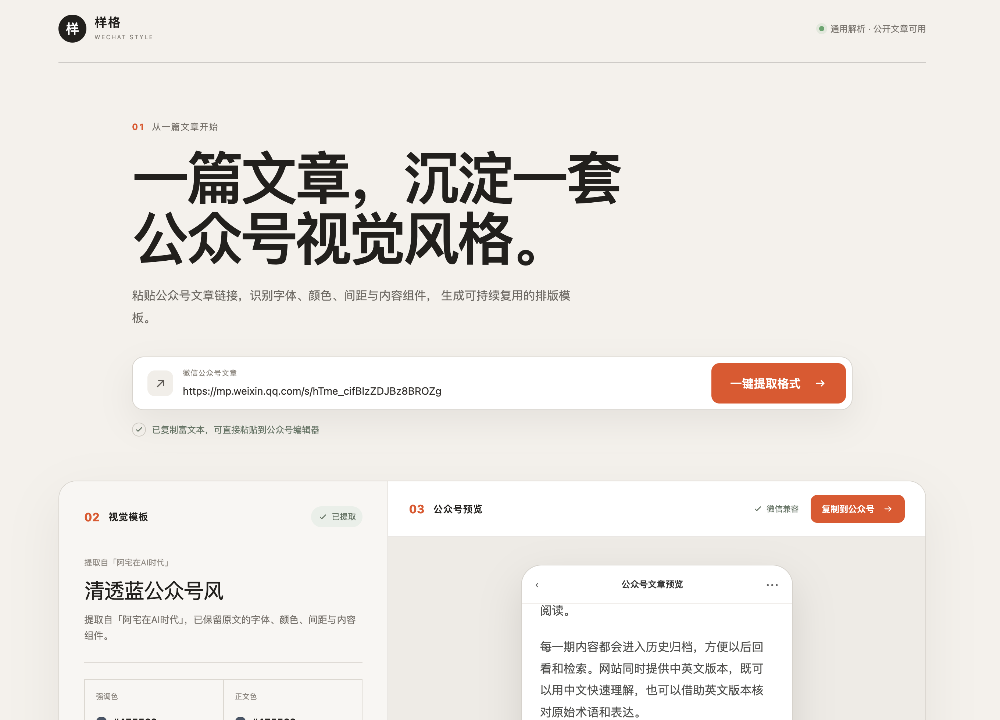

# 样格 · WeChat Style Extractor



从一篇公众号文章中识别颜色、字号、行高、间距和内容组件，将好排版沉淀为可复用的视觉模板。

## 当前版本

这是一个可交互的公众号样式提取工具，已经支持解析任意公开的公众号文章链接，并提供：

- 公众号文章链接输入
- 视觉参数与组件规则展示
- 服务端抓取、HTML 安全清洗与样式归一化
- 标题、作者、颜色、字号、行高、间距与内容组件识别
- 保留正文原图、懒加载图片以及卡片中的 CSS 背景图
- 自动内联文章样式表，保留网格、定位、阴影、列表与表格等原始排版
- 手机端公众号文章预览
- 富文本复制到公众号编辑器
- 响应式桌面与移动端界面

出于安全考虑，解析接口只访问 `https://mp.weixin.qq.com`，并限制跳转域名、响应大小与读取时间。微信偶尔会对服务器访问展示安全验证页，此时页面会给出明确提示，可稍后重试。

## 提取到的示例规则

- 强调色：`#E94F1F`
- 正文颜色：`#3F3F3F`
- 正文字号：`16px`
- 正文行高：`1.8`
- 章节标题：橙色编号、`20px` 粗体
- 重点提示：浅灰背景、左侧 4px 强调线
- 分隔组件：1px 灰色虚线、上下 24px 留白
- 结尾卡片：浅灰背景、8px 圆角

## 本地运行

需要 Node.js 22.13 或更高版本。

```bash
npm install
npm run dev
```

生产构建：

```bash
npm run build
```

测试：

```bash
npm test
```
## 网站地址
https://wechat-style-extractor.godkey810.chatgpt.site/

## 产品路线

- [x] 服务端解析任意公开公众号文章链接
- [x] 自动识别标题、正文、引用、卡片、分隔线与图片组件
- [ ] 保存多套个人视觉模板
- [ ] 输入纯文字后一键套用模板
- [ ] 图片素材迁移与公众号草稿箱同步
- [ ] 导出为可安装的 Codex Skill

## 隐私与版权

本项目只用于分析排版规则和生成原创模板。请尊重文章、图片、插画、Logo 与品牌素材的版权，不要直接搬运未经授权的内容。

## License

[MIT](LICENSE)
